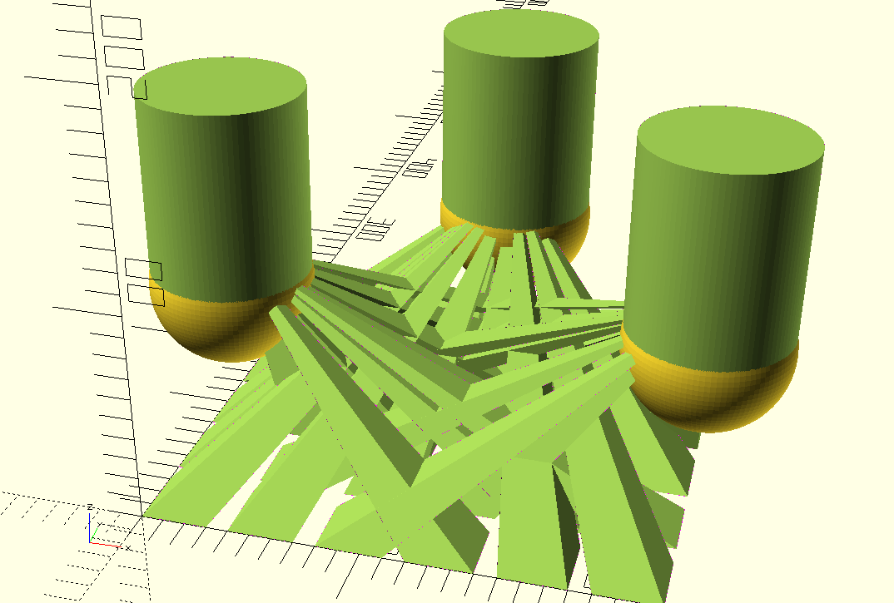
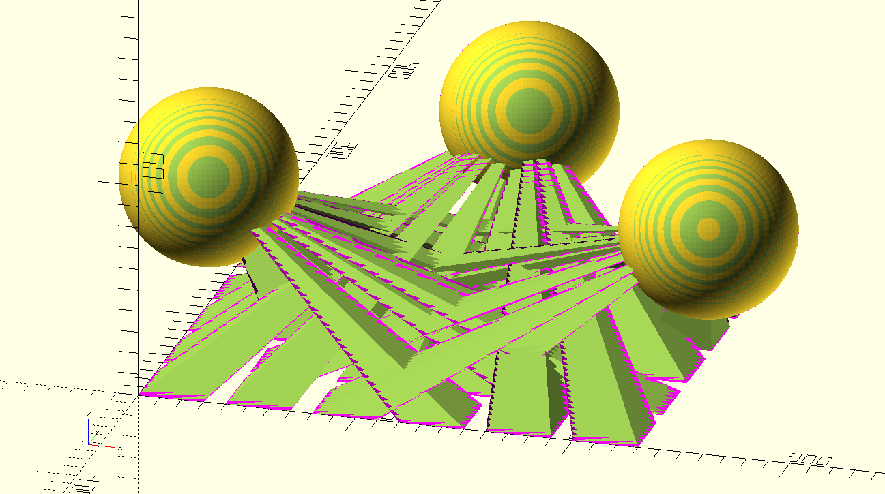
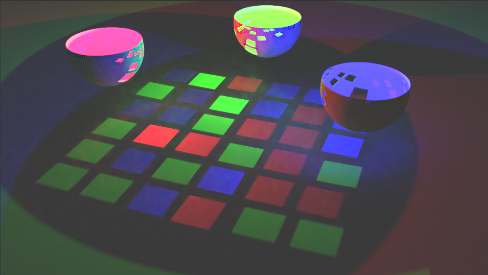
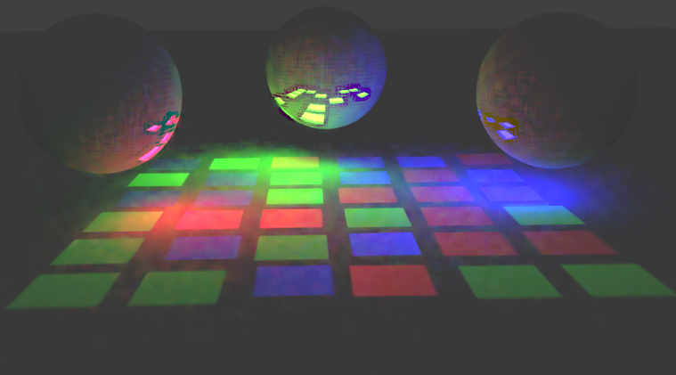

# OpenSCAD-Hypercube
Designing a [hypercube](http://www.sciencemag.org/news/2015/02/how-3d-print-hypercube) (lampshade, not 3d printer) with OpenSCAD

* Tweak [source file](openscad/hypercube.scad)
* Render with OpenSCAD
* Export to .stl
* Print

## How it works

A blank lampshade is created

Together with a light model consisting of projections and shadows, where the polyhedron bases are the projected light, gaps between them are shadows, and common apexes converging to the light source

The light model is then subtracted from the blank lampshade model

Had they been added the result would have been

Another example using a model for three light sources randomly filling in the grid

And bowls which create less light diffusion in theory.

## Rendering

The .stl model is imported into Blender, where a light source is used to model projections and shadows.

The RGB Light Bowls

The RGB Light Spheres

## Youtube videos showing counterotating hypercubes

https://www.youtube.com/watch?v=XXxTkUtxEaU  
  
https://www.youtube.com/watch?v=5aCxEEicy8I

## Todo

* Assign numerical values to descriptively-named variables before passing to function
